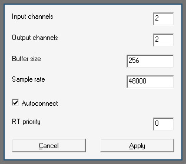

# pwasio

pwasio provides an ASIO to PipeWire for Wine. ASIO is the most common Windows
low-latency audio driver, so is commonly used in audio workstation programs.
Requires at least PipeWire 1.5.0 for shared audio buffers, which at the time
of writing needs to be built from source. Current Steam Runtime (sniper)
includes PipeWire 0.3.65, so running there will result in linking errors.

### Building

Do the following to build for 64-bit Wine.

```sh
make
```

### Installing

To install
```sh
cp lib/wine/x86_64-windows/pwasio.dll /path/to/winelibs/x86_64-windows/
cp lib/wine/x86_64-unix/pwasio.dll.so /path/to/winelibs/x86_64-unix/
```

At the time of writing, the DLLs included in a new Proton prefix are fixed at
build time, so if using Proton you must also copy the DLL to the default prefix
```sh
cp lib/wine/x86_64-windows/pwasio.dll /path/to/proton/files/share/default_pfx/drive_c/windows/system32
```

After installation, if using an existing Wine prefix you'll also need to copy
the dummy DLL to the prefix path
```sh
cp lib/wine/x86_64-windows/pwasio.dll /path/to/prefix/drive_c/windows/system32
```

Finally, the driver needs to be registered so it's visible to ASIO enabled
applications via
``` sh
WINEPREFIX=/path/to/prefix regsvr32 pwasio.dll
```

### General Information

This project comes solely out of frustration of being unable to run Ableton Live
in my current PipeWire/Proton based Arch Linux setup. This project would not at
all be possible without the skeleton laid out in the original WineASIO project,
Despite being a complete refactor, I consider pwasio a derivative work of
WineASIO and as such all original authors from that have been kept here.

In terms of features, stability and user-friendliness pwasio is merely a shadow
of what WineASIO currently is. It works, but that's literally it. Care has also
been taken so that this does not conflict with a WineASIO installation so that
users may try out both and figure out what suits them better. 

### Configuration

Configuration lives in the registry at `HKEY_CURRENT_USER\Software\ASIO\pwasio`
and can be done through the ASIO control panel while the driver is loaded.



Most options are self explanatory. However,

#### Buffer size and sample rate
These options operate through the PipeWire `PW_KEY_NODE_FORCE_QUANTUM` and
`PW_KEY_NODE_FORCE_RATE` options, which force the PipeWire graph to run under
the specific configuration. Setting these to values not supported by your
hardware might incur overhead.

#### RT priority
Defaults to zero which gives default thread scheduling. Setting this to >= 2
will give the host and the driver realtime scheduling, which may be necessary to
achieve lower latencies. The user must have realtime privileges. The value sets
the `SCHED_FIFO` priority for the driver, and the host audio thread receives a
priority of one less than what is configured (hence the minimum value nonzero
value of 2).

### Change Log

#### 0.0.1
* 26/10/2025: Driver can now run in realtime thread (GG)
* 11/10/2025: Add control panel and persistent configuration (GG)
* 10/10/2025: Use decoupled input and output streams (GG)
* 21/09/2025: PipeWire now directly uses the ASIO buffers (GG)
* 01/09/2025: Initial version (GG)

### Legal

Copyright (C) 2006 Robert Reif  
Portions copyright (C) 2007 Ralf Beck  
Portions copyright (C) 2007 Johnny Petrantoni  
Portions copyright (C) 2007 Stephane Letz  
Portions copyright (C) 2008 William Steidtmann  
Portions copyright (C) 2010 Peter L Jones  
Portions copyright (C) 2010 Torben Hohn  
Portions copyright (C) 2010 Nedko Arnaudov  
Portions copyright (C) 2011 Christian Schoenebeck  
Portions copyright (C) 2013 Joakim Hernberg  
Portions copyright (C) 2020-2023 Filipe Coelho  
Portions copyright (C) 2025 Gabriel Golfetti  

pwasio is licensed under GPL v3+, see LICENSE for more details.  
